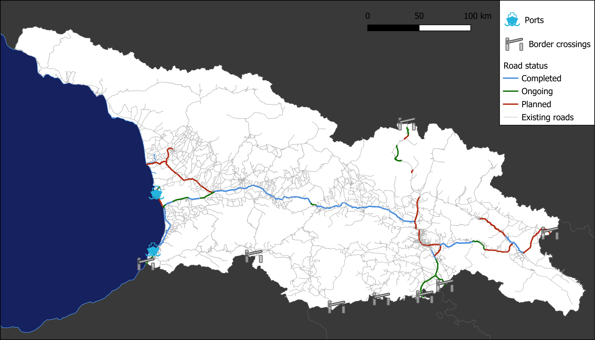
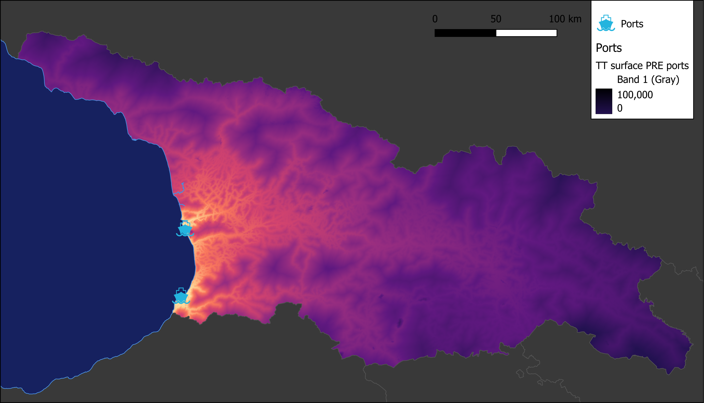
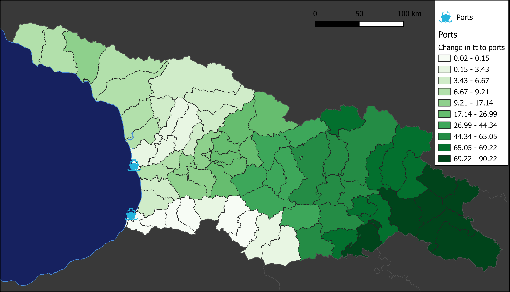

# GEO Road Improvements Market Access Analysis

This analysis evaluates the impact of road improvements in Georgia on travel time to ports and border crossings.             It compares pre- and post-intervention travel times using friction surfaces and summarizes the results at the administrative level 2 (ADM2) regions.

Improved roads were identified from OSM data and digitized where necessary; roads were attributed with improvement status from a map provided by the project team.             Friction surfaces were generated using ESA CCI landcover data and road speed information.             Travel times to the nearest ports and border crossings were calculated using the MCP algorithm, weighted by population from WorldPop data.

## Calculating Travel Time and Improvements

Travel times to ports and border crossings were calculated using both pre- and post-intervention friction surfaces.             __all roads of any status were included in the calculations__ and all speeds were increased by 20% to account for improved conditions.             The results were summarized at the ADM2 level, providing insights into how road improvements have affected accessibility in different regions.

