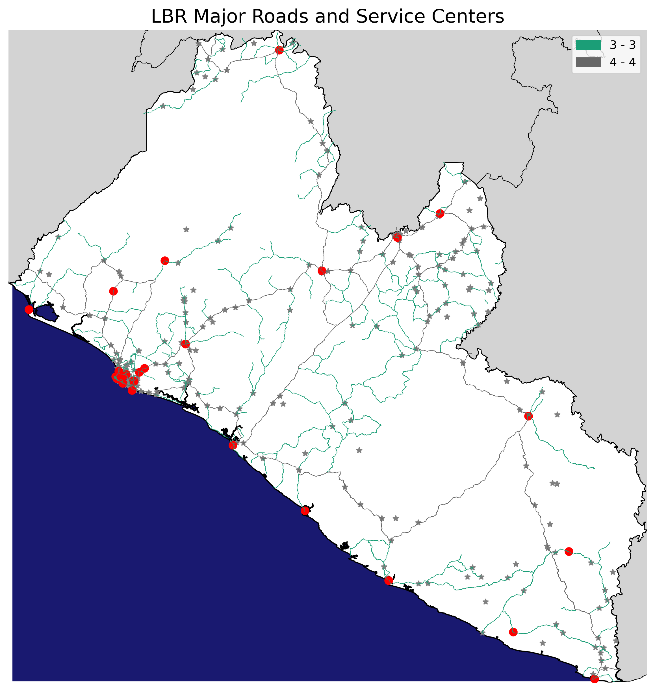
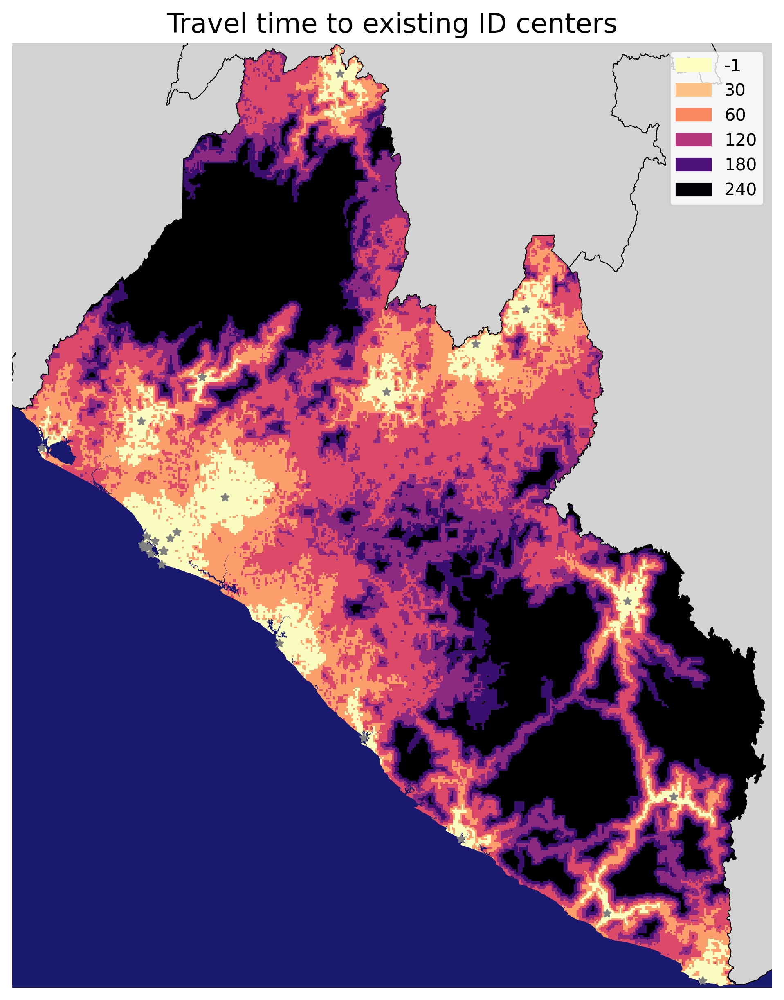
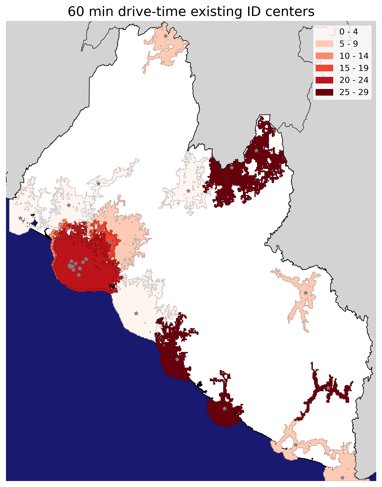
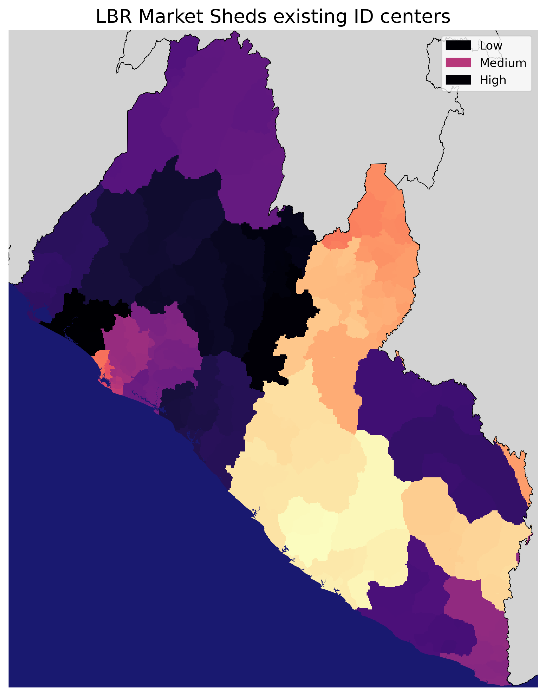
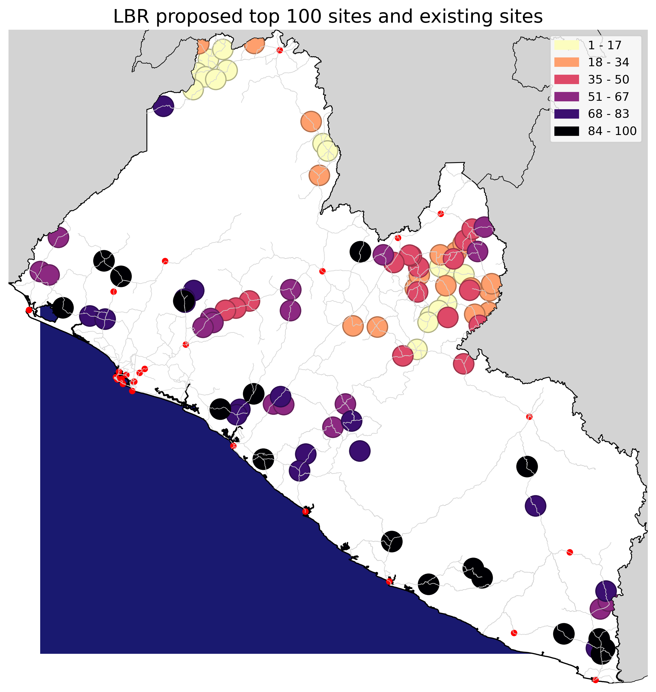

# Liberia ID centre travel time analysis

This analysis evaluates travel time to existing and proposed ID centers in Liberia.

This was done using friction surface analysis to measure travel time to service centers, and map marketsheds for service centers
The following analysis were undertaken to quantify accessibility to ID centers in Liberia:

| Question | Output file |
|---|---|
| How many people are within 60 mins and 120 mins drive time to existing ID centers, summarized at ADM1 and ADM2 levels? | ADM2_tt_existing_ID.csv |
| How many exclusive users are within 120 mins drive time to existing ID centers (Marketsheds)? | Marketshed_population_existing_ID.csv |
| What is the population outside 120 min drive time of existing centers (unserved population)? | ADM2_tt_existing_ID.csv |
| How many people are within 60, 120 min drive time to proposed centers? | ADM2_tt_proposed_ID.csv |
| What are the Marketsheds for proposed centers? | Marketshed_population_proposed_ID.csv |
| How to prioritize proposed centers sequentially to serve the most population with the fewest centers? | Top_100_proposed_ID_sites.gpkg |

## Maps of results

The friction surface analysis measures travel time to the nearest destination from every location in the country, accounting for road networks and landcover-based travel speeds.

Drive-time vectors show areas that can reach a service center within a given time threshold. This differs from the above analysis in that             each destination (ID centre) is treated independently, so the drive areas can overlap

Marketsheds show the exclusive service area for each service center, i.e., the area that is closest to a given center compared to all other centers.

The proposed top 100 sites are selected sequentially to maximize the unserved population within 60 mins drive time.
